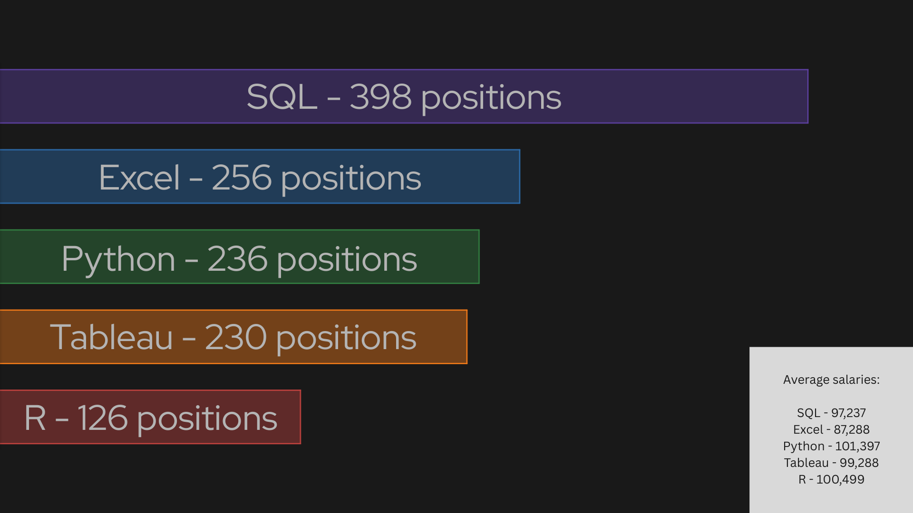

# Introduction
This project is based on the excellent [video](https://www.youtube.com/watch?v=7mz73uXD9DA) by Luke Barousse. It is my first significant foray into sql and data analysis, and will be followed by a larger, self-directed project. Since this project will therefore not be that ultimate demonstration of my skills, this analysis has intentionally been left largely informal.

The aim of this project is to find the most important skills to learn for data analysts seeking well paid jobs.

The sql queries can be found [here](/project_sql/).

# Background

The questions to answer, by query, were as follows.
1. What are the top paying data analysis jobs?
2. What are the necessary skills for the top paying data analysis jobs?
3. What are the most in demand skills for data analysis?
4. What are the top skills by salary in data analysis?
5. What are the top skills by demand and salary for data analysts seeking remote work?

# Tools I used

While this project began with me learning sql in browser with sql lite, it concluded with me using postgres and vscode to shape the final five sql queries. I created this github page as part of the project, to share my results and queries.

# The analysis

## Top skills by demand and salary for remote data analysis

```sql
SELECT
    skills_dim.skills,
    job_postings_fact.job_title_short,
    COUNT(skills_dim.skills) AS total_skill_count,
    ROUND(AVG(job_postings_fact.salary_year_avg)) AS avg_salary
FROM skills_dim
LEFT JOIN skills_job_dim ON skills_dim.skill_id = skills_job_dim.skill_id
LEFT JOIN job_postings_fact ON skills_job_dim.job_id = job_postings_fact.job_id
WHERE
    job_postings_fact.job_title_short = 'Data Analyst'
    AND
    salary_year_avg IS NOT NULL
    AND
    job_postings_fact.job_location = 'Anywhere'
GROUP BY skills_dim.skills, job_postings_fact.job_title_short
ORDER BY
    total_skill_count DESC,
    avg_salary DESC
```

This query does not attempt to remove outliers in the data, as can be seen by the many skills it identifies with high salary but only a handful of positions. Instead, it focuses primarily on skill count in order to identify what skills are desirable for one looking to find job security.

# What I learned
This visualization was, just for fun, created using only desmos and canva. Note that it only includes the first five skills from the query.



By far the most important skill for a data analyst who wants a stable, well-paying remote job is sql, with nearly four hundred positions. The next three skills - being excel, python, and tableau - are very clustered in demand. R tails behind, with less than half the demand of excel.

While all these skills were found primarily for their high demand, they also boast respectable average salaries. Even excel, with the lowest average salary, still has one above 80,000 per year.

# Conclusions

Though SQL is obviously the best skill to learn for someone in the described position, it is not the only important skill. Excel, python, and tableau are all critical as well.